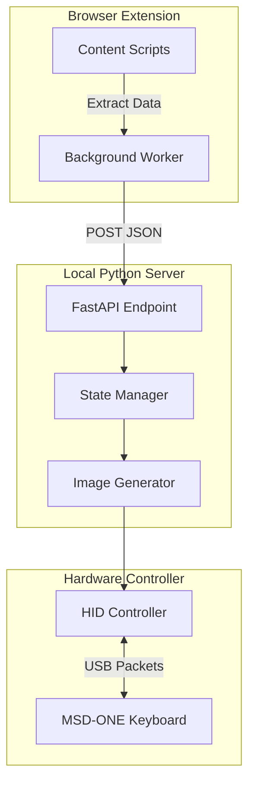

# LLM Telemetry Dashboard Implementation Plan

> **For agentic workers:** REQUIRED SUB-SKILL: Use superpowers:subagent-driven-development to implement this plan task-by-task. Steps use checkbox (`- [ ]`) syntax for tracking.

**Goal:** Build a browser extension to extract LLM limits and a Python backend to process them and display them on the MSD-ONE LCD keys.

**Architecture:** A Manifest V3 Chrome extension extracts limits from 4 LLMs, sending them to a local FastAPI Python server. The server computes visual states, generates images using Pillow, and interfaces with the MSD-ONE via PyUSB/hidapi.

**Architecture Diagram:**



**Tech Stack:** Python 3, FastAPI, pytest, Pillow, hidapi, Manifest V3 Chrome Extension.

**Spec:** [2026-08-25-llm-telemetry-msd-one-design.md](file:///Users/carlosdiez/msd-one-llms/docs/superpowers/specs/2026-08-25-llm-telemetry-msd-one-design.md)

## Global Constraints
- Python >= 3.10
- Use `pytest` for all backend testing.
- Chrome Extension must be Manifest V3.

---

### Task 1: Project Scaffolding & Python Server Setup

**Files:**
- Create: `requirements.txt`
- Create: `server/main.py`
- Create: `tests/test_main.py`

**Interfaces:**
- Produces: A running FastAPI server on port 5000 with a `/health` endpoint.

- [ ] **Step 1: Write the failing test for health endpoint**

```python
# tests/test_main.py
from fastapi.testclient import TestClient
from server.main import app

client = TestClient(app)

def test_health_check():
    response = client.get("/health")
    assert response.status_code == 200
    assert response.json() == {"status": "ok"}
```

- [ ] **Step 2: Run test to verify it fails**

Run: `pytest tests/test_main.py -v`
Expected: FAIL (module not found)

- [ ] **Step 3: Write minimal implementation**

```python
# server/main.py
from fastapi import FastAPI

app = FastAPI()

@app.get("/health")
def health_check():
    return {"status": "ok"}
```

- [ ] **Step 4: Run test to verify it passes**

Run: `pytest tests/test_main.py -v`
Expected: PASS

- [ ] **Step 5: Commit**

```bash
git add requirements.txt server/main.py tests/test_main.py
git commit -m "feat: setup FastAPI server and health check"
```

### Task 2: Telemetry State Manager API

**Files:**
- Create: `server/state.py`
- Create: `tests/test_state.py`
- Modify: `server/main.py`

**Interfaces:**
- Consumes: POST payloads `{"llm": "claude", "h5": 80, "weekly": 45, "monthly": 10}`
- Produces: `TrafficLight` enum (GREEN, YELLOW, RED, GRAY)

- [ ] **Step 1: Write the failing test for state calculation**

```python
# tests/test_state.py
from server.state import calculate_traffic_light, LLMState

def test_calculate_traffic_light_red():
    state = LLMState(llm="claude", h5=95, weekly=40, monthly=10)
    assert calculate_traffic_light(state) == "RED"

def test_calculate_traffic_light_yellow():
    state = LLMState(llm="claude", h5=85, weekly=40, monthly=10)
    assert calculate_traffic_light(state) == "YELLOW"

def test_calculate_traffic_light_green():
    state = LLMState(llm="claude", h5=50, weekly=40, monthly=10)
    assert calculate_traffic_light(state) == "GREEN"
```

- [ ] **Step 2: Run test to verify it fails**

Run: `pytest tests/test_state.py -v`
Expected: FAIL

- [ ] **Step 3: Write minimal implementation**

```python
# server/state.py
from pydantic import BaseModel

class LLMState(BaseModel):
    llm: str
    h5: float
    weekly: float
    monthly: float

def calculate_traffic_light(state: LLMState) -> str:
    # Thresholds: > 90% is RED, > 80% is YELLOW, else GREEN
    max_usage = max(state.h5, state.weekly, state.monthly)
    if max_usage >= 90:
        return "RED"
    elif max_usage >= 80:
        return "YELLOW"
    return "GREEN"
```

- [ ] **Step 4: Hook API endpoint and test**

Modify `server/main.py` to add `POST /update` endpoint that accepts `LLMState` and updates an in-memory dictionary.
Write tests in `test_main.py` to verify the endpoint correctly receives data and returns 200 OK.

- [ ] **Step 5: Commit**

```bash
git add server/state.py tests/test_state.py server/main.py tests/test_main.py
git commit -m "feat: add LLM state manager and update endpoint"
```

### Task 3: Image Generator

**Files:**
- Create: `server/image_gen.py`
- Create: `tests/test_image_gen.py`

**Interfaces:**
- Consumes: `LLMState` and Traffic Light color string.
- Produces: `bytes` of an RGB565 or PNG image (for the LCD keys).

- [ ] **Step 1: Write test for image generation**

```python
# tests/test_image_gen.py
from server.image_gen import generate_key_image

def test_generate_key_image_returns_bytes():
    img_bytes = generate_key_image("claude", "RED")
    assert isinstance(img_bytes, bytes)
    assert len(img_bytes) > 0
```

- [ ] **Step 2: Implement using Pillow**

```python
# server/image_gen.py
from PIL import Image, ImageDraw

def generate_key_image(llm: str, color: str) -> bytes:
    # Create a 72x72 square (typical macro key size, to be adjusted)
    img = Image.new('RGB', (72, 72), color='black')
    draw = ImageDraw.Draw(img)
    
    # Map color string to RGB
    colors = {"RED": (255, 0, 0), "YELLOW": (255, 255, 0), "GREEN": (0, 255, 0), "GRAY": (128, 128, 128)}
    border_color = colors.get(color, (128, 128, 128))
    
    # Draw border
    draw.rectangle([0, 0, 71, 71], outline=border_color, width=4)
    
    # Convert to bytes (raw RGB for now, will compress later if needed)
    return img.tobytes()
```

- [ ] **Step 3: Test and Commit**

```bash
git add server/image_gen.py tests/test_image_gen.py
git commit -m "feat: implement dynamic LCD key image generation with Pillow"
```

### Task 4: Hardware USB Enumerator (Prep for Reverse Engineering)

**Files:**
- Create: `hid_driver/scanner.py`

**Interfaces:**
- Produces: Console output listing connected Mars Gaming devices.

- [ ] **Step 1: Write scanner script using hidapi**

```python
# hid_driver/scanner.py
import hid

def scan_devices():
    for device in hid.enumerate():
        # Print all devices to help identify the MSD-ONE VID/PID
        print(f"VID: {device['vendor_id']:04x}, PID: {device['product_id']:04x}, Product: {device['product_string']}")

if __name__ == "__main__":
    scan_devices()
```

- [ ] **Step 2: Test by running it**

Run: `python hid_driver/scanner.py`
Expected: List of USB HID devices on the system.

- [ ] **Step 3: Commit**

```bash
git add hid_driver/scanner.py
git commit -m "feat: add HID scanner script to identify MSD-ONE VID/PID"
```

### Task 5: Chrome Extension Skeleton

**Files:**
- Create: `extension/manifest.json`
- Create: `extension/background.js`
- Create: `extension/content.js`

- [ ] **Step 1: Create Manifest V3**

Create a `manifest.json` file with `manifest_version: 3`, permissions for `activeTab`, and `host_permissions` for the LLM domains (e.g. `*://claude.ai/*`, `*://gemini.google.com/*`). Register `background.js` as the service worker and `content.js` as the content script.

- [ ] **Step 2: Create mock content.js payload sender**

```javascript
// extension/content.js
// Mock logic to send data to our local server
setInterval(() => {
    fetch('http://localhost:5000/update', {
        method: 'POST',
        headers: { 'Content-Type': 'application/json' },
        body: JSON.stringify({
            llm: 'claude',
            h5: Math.random() * 100, // mock data
            weekly: 50,
            monthly: 20
        })
    }).catch(console.error);
}, 5000);
```

- [ ] **Step 3: Commit**

```bash
git add extension/
git commit -m "feat: create Chrome extension skeleton with mock payload sender"
```
